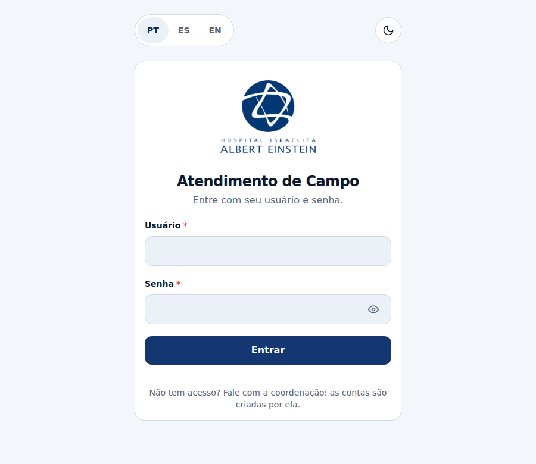
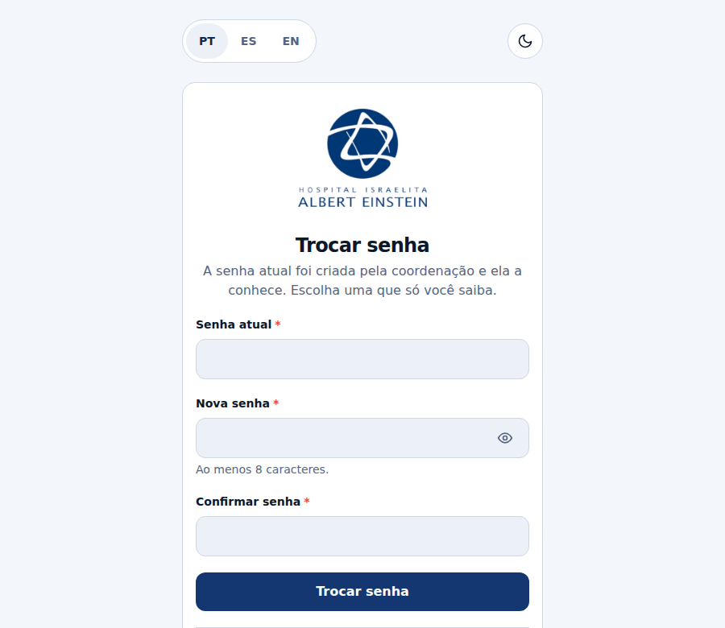
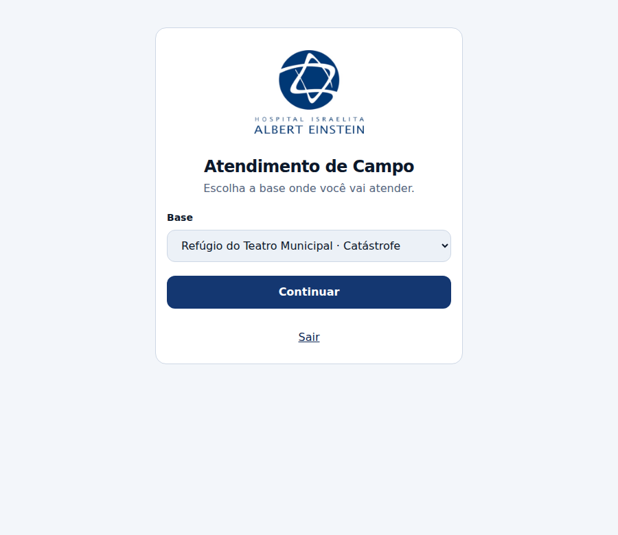
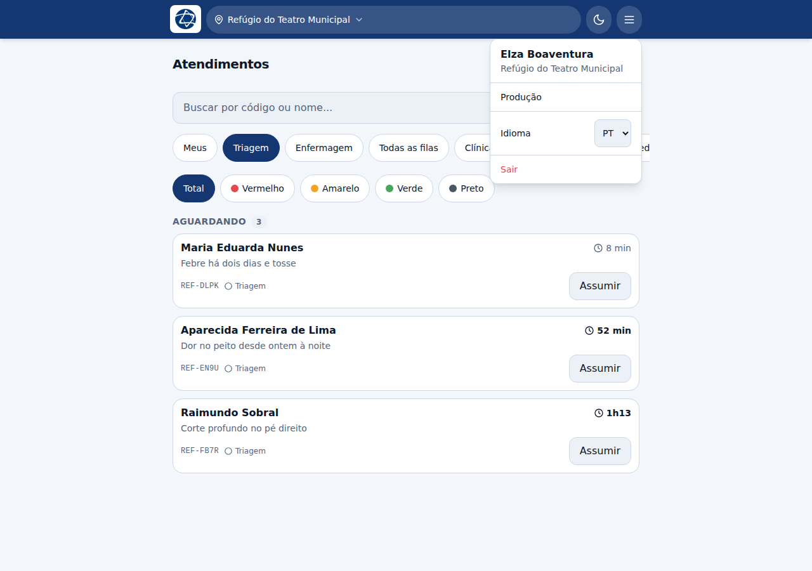

# Primeiro acesso

Vale para todo mundo, qualquer que seja a profissão.

## 1. Entrar

Usuário e senha são entregues pela coordenação. **Não existe auto-registro**: a
conta só nasce se alguém da coordenação cadastrar. Se você não tem acesso, é com
ela que se fala — a própria tela diz isso.

O seletor **PT / ES / EN** fica no topo, antes de entrar, de propósito: quem
chega e não lê português precisa trocar o idioma justamente aqui. Ao lado, o
botão de tema claro/escuro — a mesma pessoa atende sob sol forte e no escuro.

## 2. Trocar a senha provisória

A senha que a coordenação entregou é provisória e **precisa ser trocada no
primeiro acesso**. O sistema não deixa passar dessa tela antes disso.

A razão é direta: a coordenação sorteou aquela senha e a conhece. O prontuário
atribui cada ato clínico a uma pessoa, e enquanto duas pessoas souberem a senha
essa atribuição não vale.

## 3. Escolher a base

A base é o lugar onde a equipe está atendendo. A escolha importa por dois
motivos:

- o **código do paciente** leva o prefixo da base (`REF-`, `PIB-`, `ACA-`…), e
  atender na base errada gera código com o prefixo de outra;
- a fila que você vê é a **daquela base**.

Ao lado do nome aparece o tipo da operação, quando ele está definido:

- **Catástrofe** — a equipe montou base onde deu, e a triagem é o que manda;
- **Programada** — a comunidade foi combinada, com agenda e especialidades
  arranjadas de antemão.

Entrar numa base de catástrofe é um turno diferente de entrar numa missão
programada, e quem chega no meio do plantão precisa saber disso antes de abrir a
primeira ficha.

A base fica guardada no aparelho. Para trocar, toque no nome dela no cabeçalho.

## 4. O cabeçalho

A faixa de cima tem só o que muda e precisa ser conferido:

| Elemento | Para que serve |
|---|---|
| Nome da base | Confere onde você está atendendo; toque para trocar |
| Lua / sol | Alterna tema claro e escuro |
| ☰ (menu) | Seu nome, produção, idioma, gestão e sair |

Dentro do menu:

- **seu nome completo** e a base — numa equipe com duas Anas, o primeiro nome
  não diz de quem é o plantão aberto naquele aparelho;
- **Produção** — o que você concluiu (veja [Coordenação](02-coordenacao.md));
- **Idioma**;
- **Contas / Comunidades / Bases** — só para administradores;
- **Sair**.

O menu fecha ao tocar fora dele ou com `Esc`.

## Voltar

O app roda instalado, numa janela sem barra de navegador e sem botão de voltar
do sistema. Por isso **toda tela interna tem uma seta `‹` no canto superior
esquerdo**, ao lado do título. É por ela que se volta.
