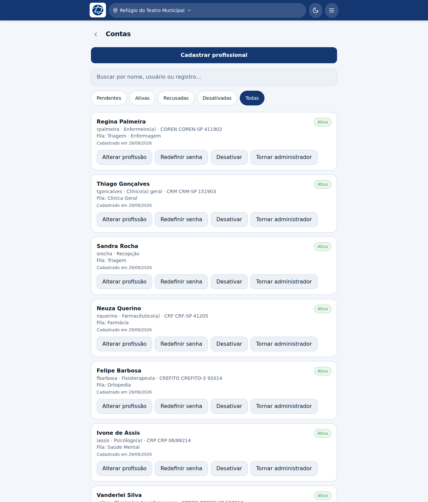
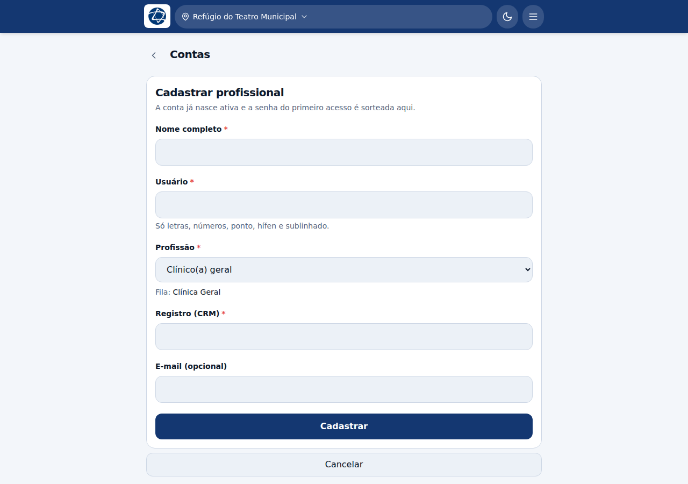
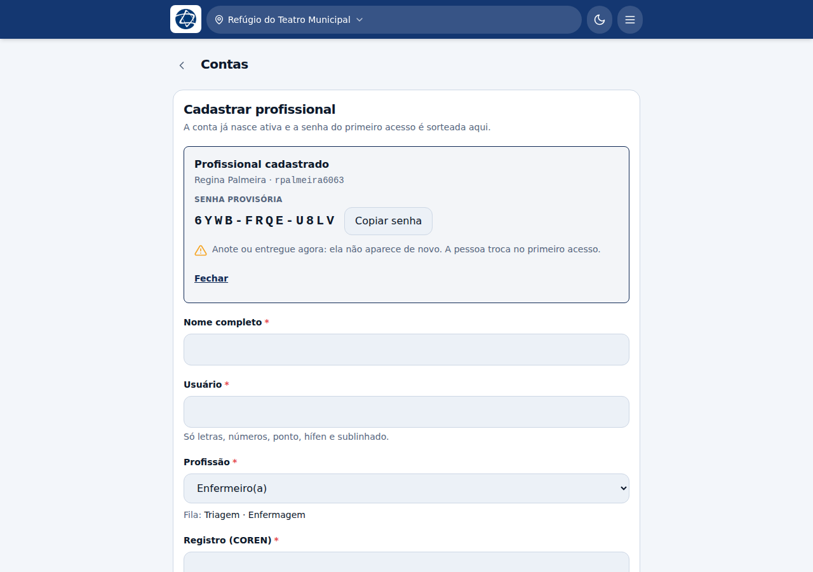
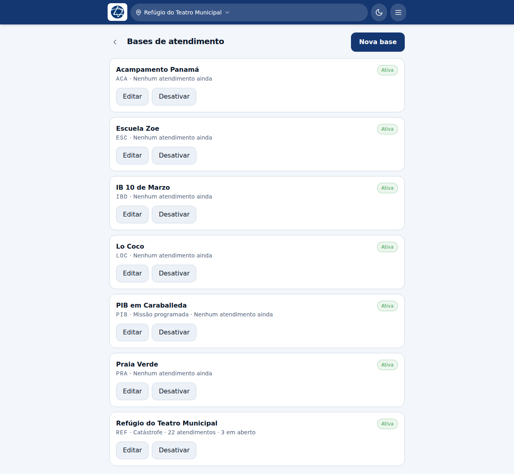
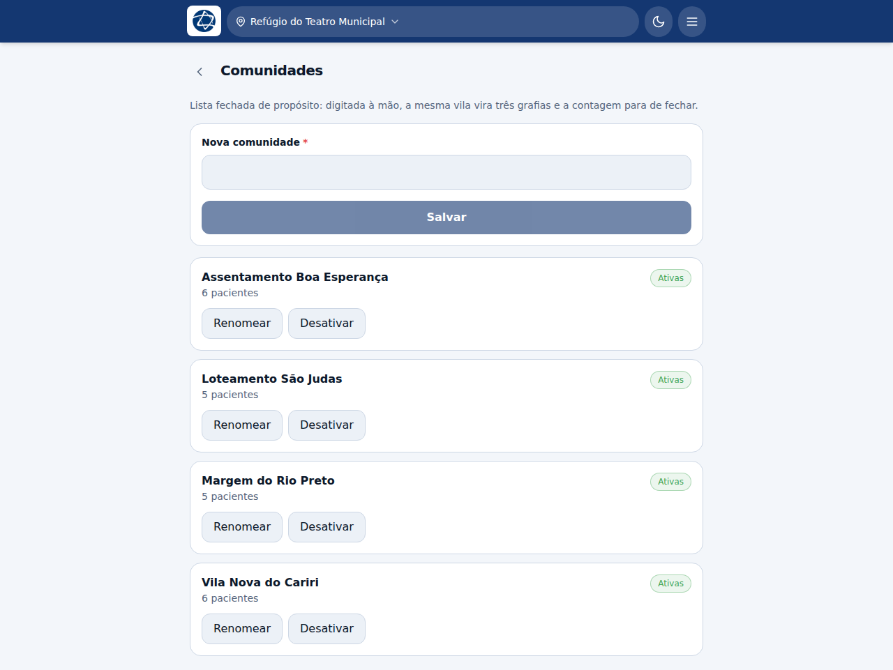
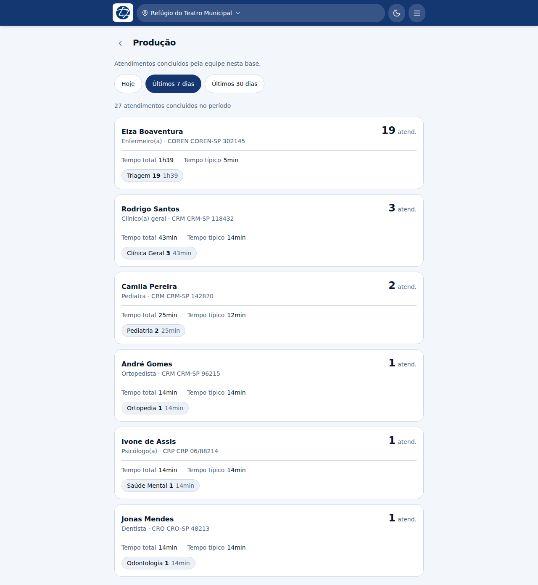

# Coordenação — o usuário administrador

O administrador é quem abre as portas do sistema. Ele não é uma profissão: é uma
permissão marcada numa conta.

## O que distingue um administrador

Uma conta tem dois eixos independentes:

- **profissão** — decide em que fila a pessoa atende (clínico, dentista,
  enfermeiro…);
- **administrador** — sim ou não, e decide se ela vê as telas de gestão.

A profissão **Coordenação** vê todas as filas, mas isso é outra coisa: dá para
ter uma coordenadora sem permissão de administrador, e um clínico geral que é
administrador. Quem administra o sistema numa missão normalmente é as duas
coisas.

Só o administrador vê, no menu do cabeçalho:

- **Contas** — cadastrar, aprovar, reclassificar, redefinir senha, desativar;
- **Comunidades** — a lista de onde os pacientes vêm;
- **Bases** — os lugares onde a equipe atende.

A tela some para quem não é administrador, mas quem garante a restrição é o
servidor: a API recusa de qualquer forma.

## Como nasce o primeiro administrador

Não existe um usuário `admin` com senha padrão embutida — isso seria uma porta
aberta num sistema publicado na internet.

O primeiro administrador vem da **configuração do servidor**, definida por quem
faz o deploy:

| Variável | O que é |
|---|---|
| `Admin__Usuario` | Nome de usuário da conta |
| `Admin__Senha` | Senha escolhida por quem opera o deploy |
| `Admin__Nome` | Nome que aparece na assinatura das fichas |

No primeiro boot com essas variáveis preenchidas, a conta é criada como
Coordenação, ativa e administradora. Ela **não** exige troca de senha no primeiro
acesso — ao contrário das contas criadas pela coordenação, não há um terceiro que
a conheça.

Alguns detalhes que importam na operação:

- **o boot não sobrescreve a senha de uma conta que já existe.** Se o usuário
  configurado já está no banco, o sistema só restaura o que faltar (reativa a
  conta, devolve a permissão de administrador) e deixa a senha em paz — trocá-la
  a cada reinício atrapalharia quem já usa a conta;
- **sem as variáveis preenchidas, o boot só registra um aviso e segue.** Se não
  houver nenhum administrador no banco, ninguém consegue cadastrar ninguém: o
  sistema fica de pé e travado;
- **a senha nunca fica no código nem no banco em texto claro.** O banco guarda só
  o hash.

Para dar a permissão a outra pessoa depois, use **Tornar administrador** na tela
de Contas.

## Contas

A tela abre na lista, não no cadastro: o que se vem fazer aqui no dia a dia é
conferir quem tem acesso, redefinir a senha de quem perdeu e reclassificar quem
mudou de função. Cadastrar gente nova é o ato raro.

Cada conta mostra o usuário, a profissão, o registro no conselho, **as filas que
ela enxerga** e a data do cadastro. Os filtros no topo — Pendentes, Ativas,
Recusadas, Desativadas, Todas — separam por situação.

As ações por conta:

| Ação | Quando usar |
|---|---|
| **Alterar profissão** | A pessoa mudou de função, ou a conta é antiga e está como "Médico" genérico. Muda também as filas que ela vê. |
| **Redefinir senha** | A pessoa perdeu a senha. Sorteia uma nova provisória e exige troca no próximo acesso. |
| **Desativar** | A pessoa saiu da missão. A conta para de entrar, mas o que ela registrou continua atribuído a ela. |
| **Tornar administrador** | Dá acesso às telas de gestão. |

### Cadastrar um profissional

O formulário abre pelo botão **Cadastrar profissional**. Campos:

- **Nome completo** — é o que assina a ficha e aparece no histórico;
- **Usuário** — só letras, números, ponto, hífen e sublinhado. A tela avisa na
  hora se já estiver em uso;
- **Profissão** — logo abaixo dela o sistema mostra **quais filas** a pessoa
  passará a ver, antes de você confirmar;
- **Registro no conselho** — o rótulo muda conforme a profissão (CRM, CRO,
  COREN, CRP, CREFITO, CRF);
- **E-mail** — opcional.

A conta **já nasce ativa**. Não há fila de aprovação quando quem cadastra é a
coordenação: o ato de cadastrar já é a aprovação.

O filtro **Pendentes** e o contador no menu do cabeçalho continuam existindo para
contas em situação pendente — nelas aparecem os botões **Aprovar** e **Recusar**
(a recusa pede o motivo, que fica registrado). Na operação normal de hoje essa
aba fica vazia, e é por isso que a tela abre em "Todas".

### A senha provisória aparece uma vez só

Depois de cadastrar, a senha do primeiro acesso aparece em letras grandes, com
botão de copiar. **Anote ou entregue naquele momento.**

O servidor guarda apenas o hash: não existe tela onde consultar essa senha
depois. Se ela se perder, o caminho é **Redefinir senha** na lista, que sorteia
outra.

O formulário continua aberto e limpo para a próxima pessoa — em campo o cadastro
é feito em série, uma pessoa atrás da outra. Quem terminou fecha com
**Cancelar**.

## Bases

A base é o lugar físico onde a equipe atende. Cada uma tem:

- **nome**;
- **prefixo de código** (três letras) — é o que entra no código de cada paciente
  cadastrado ali, como `REF-JP6B`. O sistema sugere um a partir do nome;
- **tipo de missão** — Programada ou Catástrofe, ou nenhum.

O cartão mostra quantos atendimentos a base já teve e quantos estão em aberto.

**Desativar** tira a base da lista de escolha sem apagar nada: os atendimentos
feitos nela continuam no sistema. Quem estava com ela guardada no aparelho é
mandado de volta para a seleção de base no próximo acesso.

## Comunidades

É a lista de onde os pacientes vêm — vila, assentamento, loteamento. No cadastro
do paciente ela aparece como lista de escolha, **não como texto livre**, e o
motivo está escrito na própria tela: digitada à mão, a mesma vila vira três
grafias e a contagem para de fechar.

Cada comunidade mostra quantos pacientes estão ligados a ela. **Renomear**
corrige a grafia em todos de uma vez. **Desativar** tira da lista de escolha sem
mexer em quem já está cadastrado.

Vale manter esta lista antes de a missão começar: é ela que permite responder
"quantas pessoas da Margem do Rio Preto foram atendidas".

## Produção

Quanto a equipe atendeu, por pessoa, na base atual. Os filtros são **Hoje**,
**Últimos 7 dias** e **Últimos 30 dias**.

Cada cartão traz:

- o total de atendimentos concluídos pela pessoa;
- **tempo total** e **tempo típico** (a mediana, não a média — um atendimento que
  ficou aberto o plantão inteiro não distorce o número);
- a divisão por fila.

A tela **não é exclusiva da coordenação**: qualquer pessoa pode abri-la pelo
menu. A diferença está no que o servidor devolve — quem não é coordenação recebe
só a própria produção. Ver o próprio trabalho somado não é privilégio de
ninguém.
