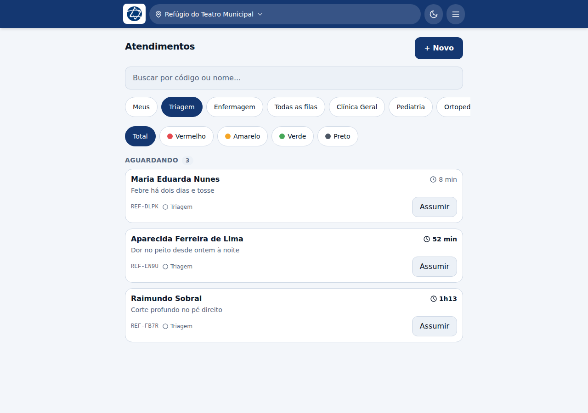
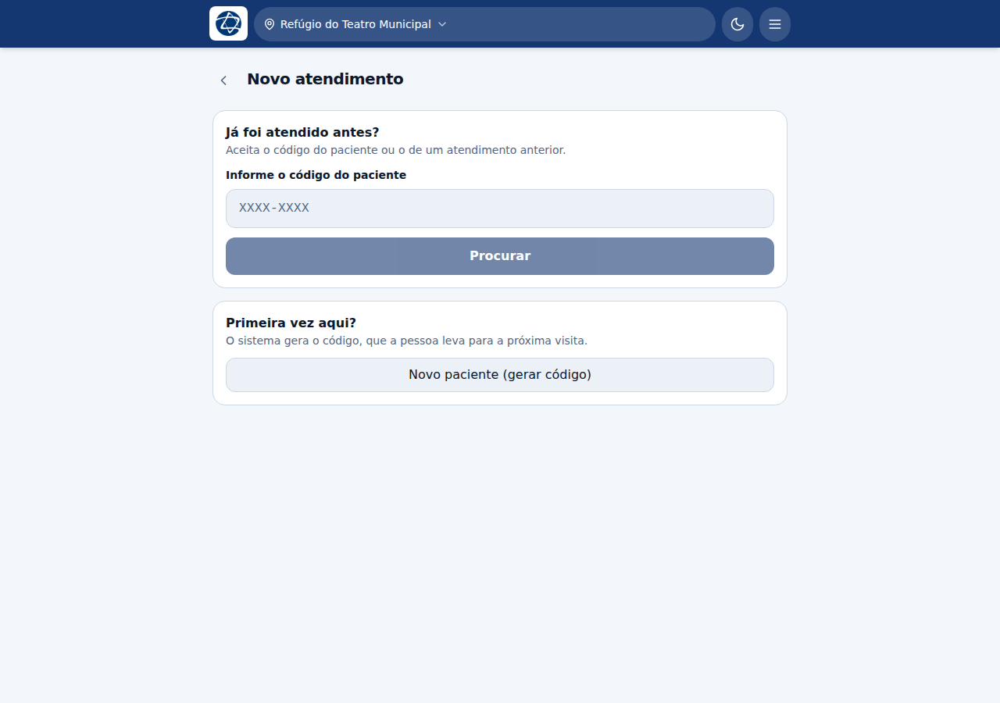
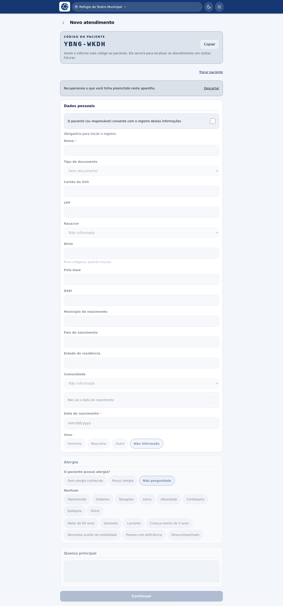

# Recepção e cadastro

**Profissão:** Recepção · **Fila:** Triagem

A recepção cadastra quem chega e acompanha quem está esperando para ser triado.
O cadastro também é feito por qualquer outra pessoa da equipe quando não há
recepção — o botão **+ Novo** está na fila de todo mundo.

## A fila

A recepção abre na fila da **Triagem**, que é onde estão os que acabaram de ser
cadastrados e ainda não foram classificados.

Cada cartão mostra:

- **nome completo** do paciente — é pelo nome que se chama na tenda;
- a **queixa principal**;
- o **código do atendimento** (`REF-4YGY`), em fonte monoespaçada, para ler letra
  por letra;
- **há quanto tempo espera**, no canto direito. Passados 30 minutos o número
  ganha destaque;
- as **etapas** por que o paciente passou ou vai passar, com ✓ nas concluídas.

A busca no topo aceita **código ou nome**.

## Cadastrar quem chega

O botão **+ Novo** abre uma tela só, com os dois caminhos:

**"Já foi atendido antes?"** vem primeiro e já com o campo aberto. Aceita o
código do paciente **e também o código de um atendimento anterior dele** — em
campo a pessoa costuma trazer o papel da última visita, não o número decorado.

**"Primeira vez aqui?"** vem embaixo. O sistema gera o código, que a pessoa leva
consigo para a próxima visita.

A ordem não é decorativa. A maioria das pessoas atendidas não tem documento, e o
código é o único fio que liga uma visita à seguinte. Procurar primeiro é o que
evita cadastrar a mesma pessoa duas vezes e perder o histórico dela.

> Se o código não existir, a tela avisa em vez de abrir uma ficha em branco.

## O cadastro

O código aparece no topo, já sorteado, com botão de copiar. **Nada é gravado
até você salvar**: o código só vira cadastro quando o formulário é enviado.

Se você tinha começado um cadastro neste aparelho e a tela fechou, uma faixa
avisa *"Recuperamos o que você tinha preenchido neste aparelho"*, com a opção de
**Descartar**. O rascunho é local e não chegou a ninguém.

### O que é obrigatório

- **Consentimento** do paciente (ou do responsável) — é o primeiro campo, e sem
  ele o registro nem começa;
- **Nome**;
- **Data de nascimento** — ou marque **"Não sei a data de nascimento"**, que
  troca o campo por *idade aproximada*;
- **nome da mãe** e **endereço**, que aparecem quando o paciente é menor de
  idade.

Todo o resto é opcional, de propósito: uma pessoa que chega sem documento, sem
saber onde mora e sem ninguém junto precisa poder ser atendida.

### Campos que costumam gerar dúvida

| Campo | O que registrar |
|---|---|
| **Tipo e número do documento** | O documento que a pessoa tem em mãos |
| **Cartão do SUS** e **CPF** | Campos próprios, separados do documento — a pessoa pode ter RG *e* CPF *e* cartão do SUS, e como "tipo" um excluiria o outro |
| **Raça/cor** | Lista do IBGE, **autodeclarada**. "Não informado" é uma resposta válida: chutar por aparência é pior que não ter |
| **Etnia** | O povo indígena (Yanomami, Ye'kwana…). É diferente de raça/cor, e não cabe em lista fechada |
| **Polo base** e **DSEI** | Referências da saúde indígena, quando se aplicam |
| **Comunidade** | Escolhida da lista mantida pela coordenação |
| **Alergia** | Três estados: *sem alergia conhecida*, *possui alergia* e *não perguntado*. Marque o que é verdade — veja abaixo |
| **Queixa principal** | Em uma linha. É o que aparece no cartão da fila e orienta quem vai triar |

### Sobre a alergia

O alerta vermelho de alergia que aparece nas fichas clínicas **só dispara em
"possui alergia"**. Marcar "não perguntado" quando ninguém perguntou é o
comportamento certo: é diferente de a pessoa ter respondido que não tem.

Preencher "possui alergia" por precaução em quem não tem faz o alerta aparecer em
todo mundo — e um alerta que aparece sempre deixa de ser lido justamente no caso
real.

### Condições crônicas e vulnerabilidades

Marcadores que acompanham o paciente entre visitas: hipertensão, diabetes, asma,
tabagismo; gestante, lactante, idoso 65+, criança menor de 5, deficiência,
desacompanhado, auxílio de mobilidade.

São eles que permitem, depois, achar rápido quem precisa de atenção especial.

## Depois de salvar

O paciente entra na **fila da Triagem** e some da sua tela de cadastro. O código
dele é o que ele leva embora.
