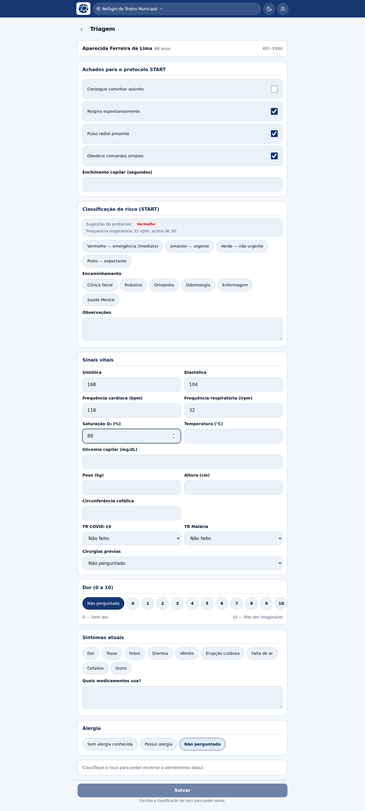
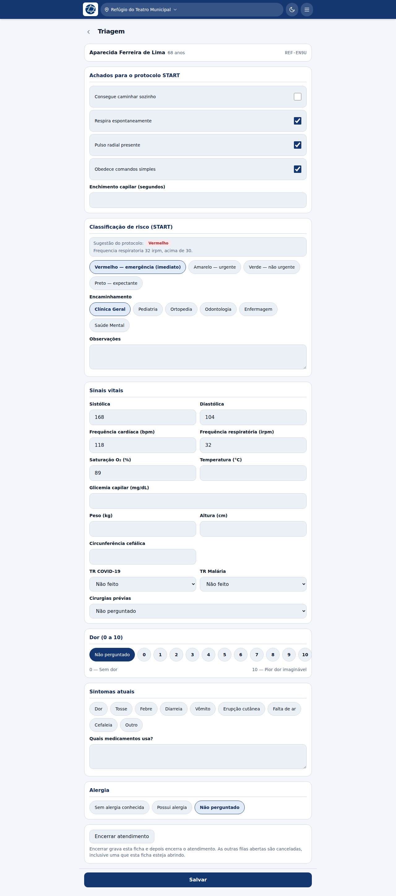

# Triagem

**Profissões:** Enfermeiro(a), Técnico(a) de enfermagem · **Fila:** Triagem

A triagem classifica o risco pelo protocolo **START** e decide para onde o
paciente vai. É a etapa que ordena a fila inteira.

Quem abre nesta fila é a enfermagem (que vê também a fila de Enfermagem) e a
recepção. Qualquer outra pessoa pode triar quando a fila estoura — fica
registrado no histórico que o atendimento foi feito fora da fila habitual.

## Abrir a ficha

Na fila, toque em **Assumir** no cartão do paciente e depois no cartão para abrir
o prontuário; de lá, a etapa da triagem leva à ficha.

No topo, sempre: **nome do paciente, idade e código**. Se o paciente tiver
alergia registrada, o alerta aparece aqui. Numa tenda com vários aparelhos
abertos, é esse cabeçalho que impede a triagem de um paciente ser gravada no
prontuário de outro.

## 1. Achados do protocolo START

Vêm primeiro, antes dos sinais vitais. É a ordem do próprio protocolo: o START
foi desenhado para ser feito em menos de um minuto, sem aparelho nenhum.

| Achado | Observação |
|---|---|
| Consegue caminhar sozinho | |
| Respira espontaneamente | |
| Voltou a respirar após abertura de via aérea | Só aparece quando o anterior está desmarcado |
| Pulso radial presente | |
| Obedece comandos simples | |
| Enchimento capilar (segundos) | |

## 2. A sugestão aparece antes da escolha

Conforme os achados são marcados — e conforme a frequência respiratória é
digitada nos sinais vitais — o sistema busca a avaliação do protocolo e mostra
**a cor sugerida e o motivo**, ao lado das opções de classificação.

Duas coisas importantes:

- **a sugestão não marca nada.** Ela informa; quem classifica é você;
- **a cor que você escolher é a que vale.** Se você discordar da sugestão, a sua
  escolha prevalece — e a divergência fica registrada no histórico do
  atendimento, com a cor sugerida e a escolhida.

Sem sinal, a sugestão simplesmente não aparece e a triagem continua inteira.

## 3. Classificar e encaminhar

| Cor | Significado |
|---|---|
| **Vermelho** | Emergência — imediato |
| **Amarelo** | Urgente |
| **Verde** | Não urgente |
| **Preto** | Expectante |

A classificação é **obrigatória para salvar**. Enquanto ela não for escolhida, a
tela diz o que falta em vez de só deixar o botão apagado.

Logo abaixo, **Encaminhamento**: a fila para onde o paciente vai. É o que o tira
da triagem e o põe na fila seguinte.

## 4. Sinais vitais e o resto

Vêm depois da decisão, para quem tem tempo de fazer todas as medidas:

- pressão sistólica e diastólica, frequência cardíaca e respiratória, saturação
  de O₂, temperatura, glicemia capilar;
- peso, altura e circunferência cefálica — o peso é o que permite conferir dose
  pediátrica;
- **testes rápidos** de COVID-19 e malária, cada um com *não feito* como padrão;
- **cirurgias prévias** — *não perguntado* é diferente de "não";
- **escala de dor de 0 a 10** — de 0, e não de 1: "sem dor" é uma resposta, e
  *não perguntado* é a ausência dela;
- **sintomas atuais** e medicamentos em uso;
- **alergia**, que pode ser corrigida aqui se a recepção não perguntou.

O IMC é calculado sozinho a partir de peso e altura, e aparece já no prontuário.
Em menores de 20 anos a faixa da OMS não é mostrada: em criança o IMC se lê em
curva por idade, e o corte de adulto diria "baixo peso" para uma criança
saudável.

## Salvar

O botão **Salvar** fica grudado no rodapé da tela: não é preciso rolar o
formulário inteiro para gravar o que já foi preenchido.

## Dar alta direto da triagem

O bloco **Encerrar atendimento**, no fim da ficha, encerra o atendimento inteiro
sem passar por mais nenhuma fila — é o caso de quem só veio medir a pressão.

A alta pela triagem **só é oferecida depois da classificação de risco**, porque é
ela que a API exige para gravar a ficha. Veja
[Alta e desfecho](11-alta-e-desfecho.md).
