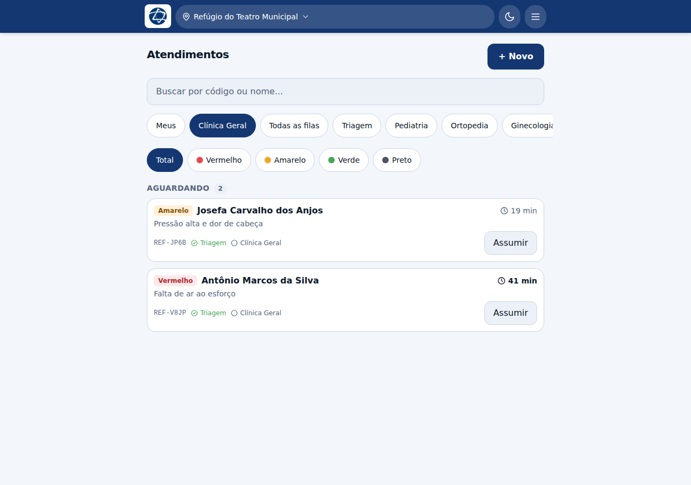
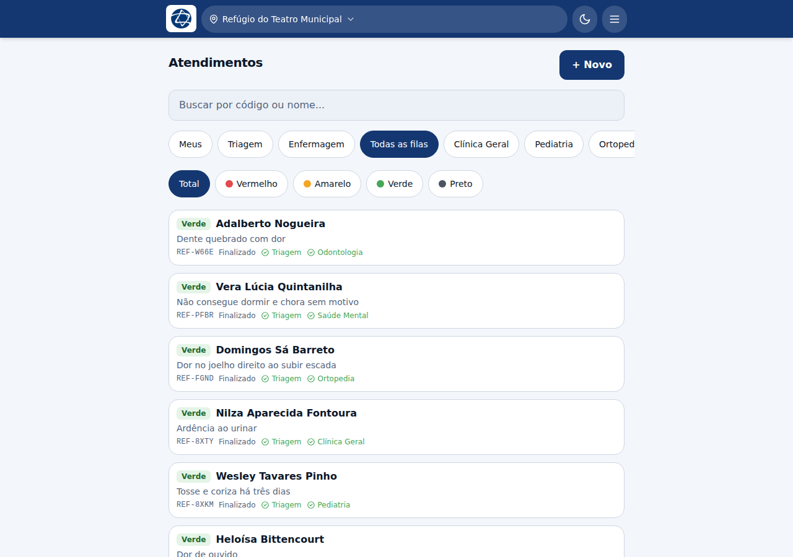
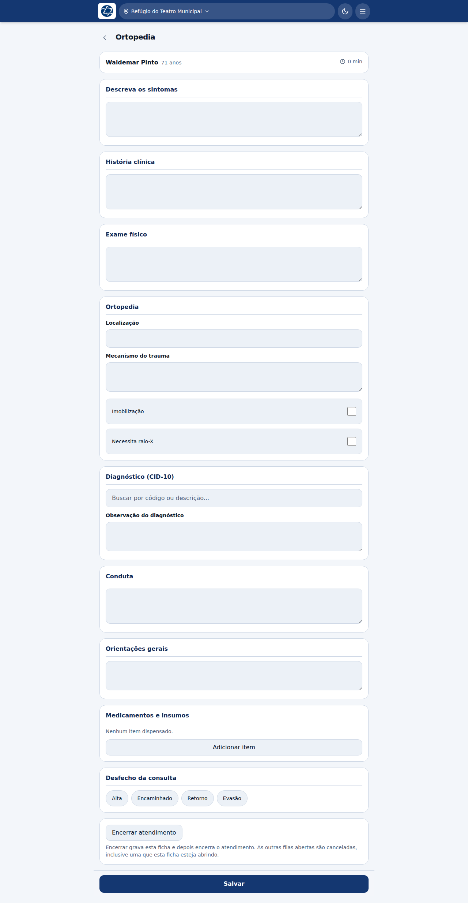
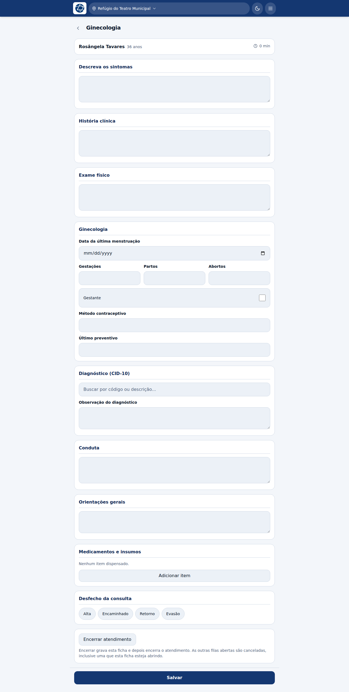
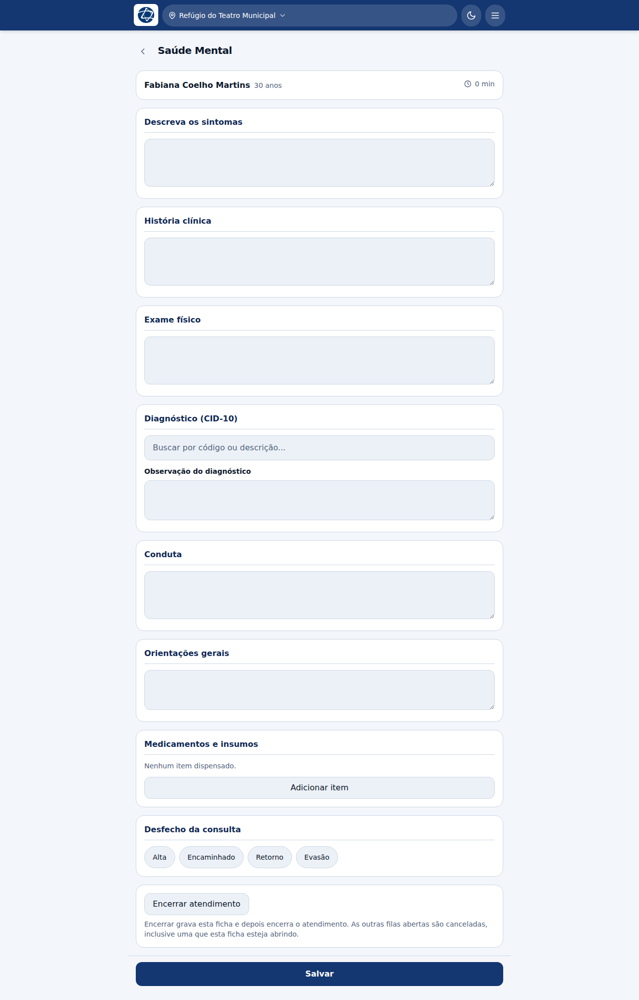
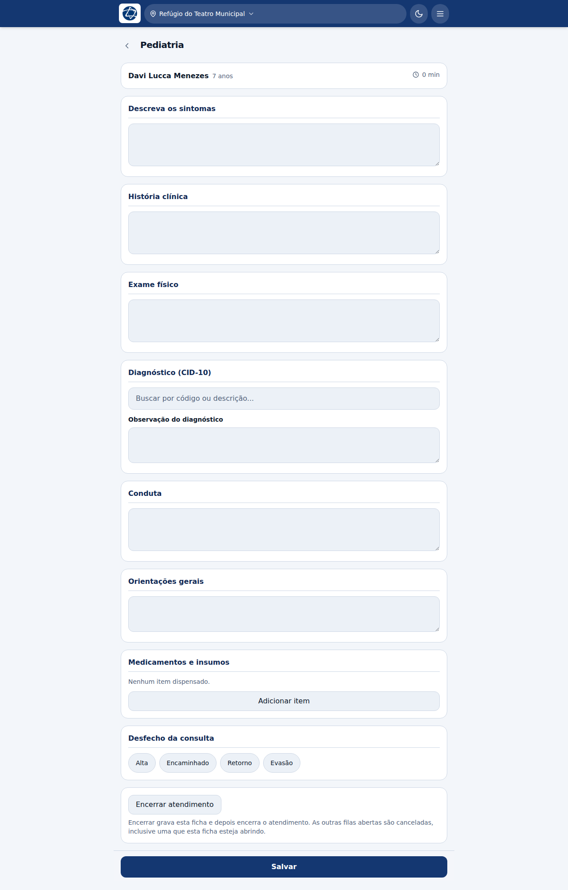

# Consultas

**Profissões e filas:**

| Profissão | Fila |
|---|---|
| Clínico(a) geral | Clínica Geral |
| Pediatra | Pediatria |
| Ortopedista | Ortopedia |
| Ginecologista | Ginecologia |
| Cardiologista | Cardiologia (teleconsulta) |
| Psicólogo(a) | Saúde Mental |
| Fisioterapeuta | Ortopedia |

Todas usam a **mesma ficha de consulta**. Três delas acrescentam um bloco
próprio, descrito no fim desta página.

## A sua fila

Ao entrar, a lista já abre na fila da sua profissão — o dentista abre na
odontologia, o pediatra na pediatria. As abas no topo permitem olhar as outras:
**Meus**, a sua fila, **Todas as filas** e cada especialidade.

Abaixo das abas, os **filtros por risco**: Total, Vermelho, Amarelo, Verde,
Preto.

Os pacientes triados chegam com a **etiqueta de risco escrita** ao lado do nome —
não é só um ponto colorido, porque o critério de ordenação do protocolo precisa
servir também a quem não distingue cores.

Em **Todas as filas** dá para ver a operação inteira: quem está em que etapa, com
que risco, e quais etapas já foram concluídas (✓). Quem ainda não foi triado
aparece sem etiqueta — "sem triagem" repetido em todo cartão seria uma coluna de
ruído.

**Assumir** tira o paciente da fila dos outros. Se você assumiu e não vai
atender, **Liberar** o devolve.

## A ficha de consulta

| Bloco | O que registrar |
|---|---|
| **Descreva os sintomas** | O relato do paciente |
| **História clínica** | Bloco próprio, e não um pedaço do anterior: juntos, o segundo deixa de ser respondido |
| **Exame físico** | O que você constatou |
| **Diagnóstico (CID-10)** | Busca por código ou descrição. Abaixo, uma observação livre do diagnóstico |
| **Conduta** | O que foi feito e prescrito |
| **Orientações gerais** | O que o paciente leva de instrução |
| **Medicamentos e insumos** | Itens dispensados, pelo catálogo — veja abaixo |
| **Desfecho da consulta** | Alta, Encaminhado, Retorno ou Evasão |

O **CID-10** é obrigatório para concluir a consulta.

> **Desfecho da consulta** e **encerramento do atendimento** são coisas
> diferentes. O primeiro diz como *esta consulta* terminou; o segundo fecha o
> atendimento inteiro. Veja [Alta e desfecho](11-alta-e-desfecho.md).

### Medicamentos e insumos

**Adicionar item** abre a busca no catálogo da base. O que sai por aqui é
registrado como dispensação, com quantidade e via — é o que permite à farmácia e
à coordenação saber o que foi entregue.

### Salvar

O botão fica grudado no rodapé, visível sem rolar a ficha inteira.

## Para onde mandar o paciente depois

No prontuário, **Encaminhar para outra fila** põe o paciente na fila escolhida e
pede o motivo. Ele sai da sua e entra na próxima, contado a partir de agora — o
tempo de espera reinicia naquela fila.

Se o paciente veio encaminhado de outra fila e você terminou o que lhe cabia,
**Devolver** o manda de volta para quem o mandou, sem você precisar lembrar de
onde ele veio: o sistema sabe.

## Blocos próprios de cada especialidade

### Ortopedia

Acrescenta **localização** da queixa, **mecanismo do trauma**, e as marcações
**imobilização** e **necessita raio-X**.

O fisioterapeuta atende nesta mesma fila e vê esta mesma ficha.

### Ginecologia

Acrescenta **data da última menstruação**, **gestações / partos / abortos**,
**gestante**, **método contraceptivo** e **último preventivo**. Marcando
*gestante*, abre também **semanas de gestação**.

### Saúde mental

Acrescenta **sintomas** (tristeza, ansiedade, insônia, luto, ideação suicida,
agitação) e **perdas vivenciadas** (casa, familiar, animal de estimação,
trabalho, documentos).

As perdas não são detalhe: numa operação de catástrofe são elas que explicam o
quadro, e registrá-las é o que permite dimensionar o apoio que a comunidade vai
precisar depois que a equipe for embora.

### Pediatria

Usa a ficha de consulta sem bloco extra. O que muda é o que vem da triagem: peso,
altura e circunferência cefálica, e o IMC sem faixa de adulto.
