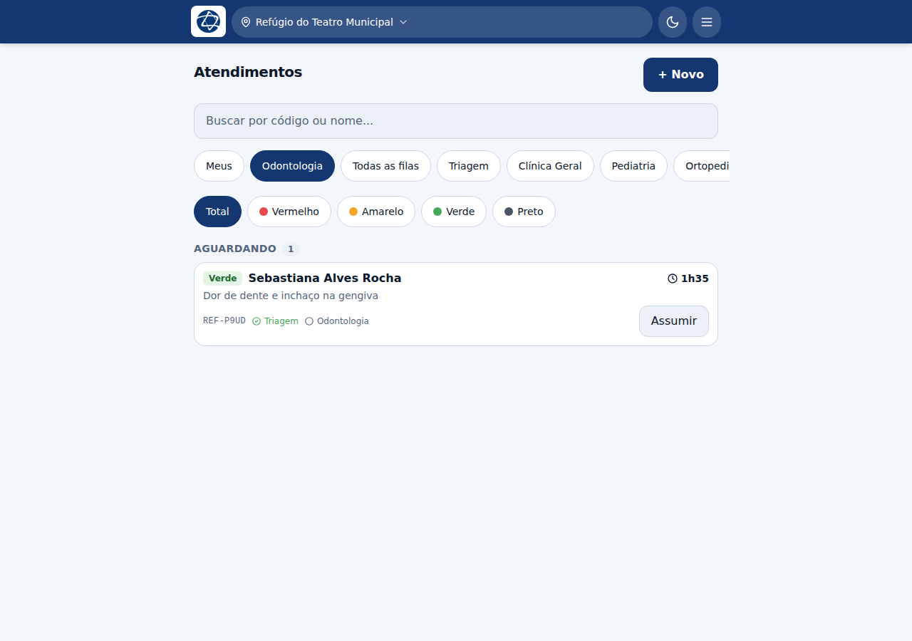
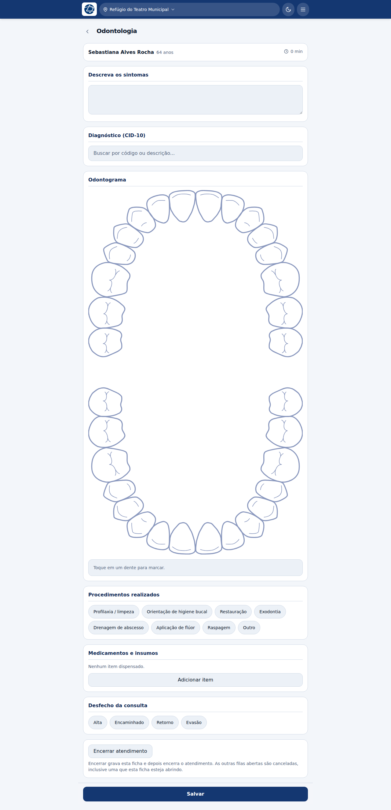
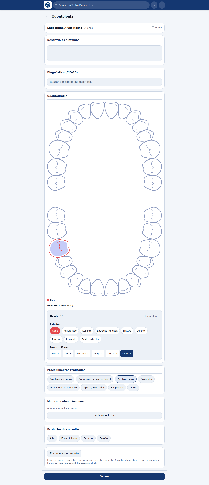

# Odontologia

**Profissão:** Dentista · **Fila:** Odontologia

## A fila

O dentista abre direto na fila da odontologia. Assumir, atender, encerrar ou
encaminhar funcionam como nas demais filas.

## A ficha

| Bloco | O que registrar |
|---|---|
| **Descreva os sintomas** | O relato do paciente |
| **Diagnóstico (CID-10)** | Busca por código ou descrição |
| **Odontograma** | O estado dos dentes — veja abaixo |
| **Procedimentos realizados** | Profilaxia, orientação de higiene, restauração, exodontia, drenagem de abscesso, aplicação de flúor, raspagem, outro |
| **Medicamentos e insumos** | O que foi dispensado |
| **Desfecho da consulta** | Alta, Encaminhado, Retorno, Evasão |

## O odontograma

Toque em um dente para selecioná-lo. O painel abaixo mostra o número do dente
(notação FDI) e os estados que podem ser marcados:

- Hígido, Cárie, Restaurado, Ausente, Extração indicada, Fratura, Selante,
  Prótese, Implante, Resto radicular.

**Um dente pode ter mais de um estado ao mesmo tempo.** Um dente com cárie *e*
extração indicada carrega as duas marcações — no odontograma de papel ele seria
pintado de uma cor só e a cárie sumiria do desenho.

Para **cárie, restauração, fratura e selante** você também escolhe as **faces**
(mesial, distal, oclusal, vestibular, lingual, incisal, cervical).

Abaixo do desenho aparecem:

- a **legenda** dos estados presentes na boca daquele paciente;
- um **resumo em texto** — é o que aparece no prontuário e no histórico, legível
  sem o desenho.

**Limpar dente** remove todas as marcações do dente selecionado.

## Salvar e encerrar

O botão **Salvar** fica no rodapé. O bloco **Encerrar atendimento**, no fim,
fecha o atendimento inteiro com o desfecho — veja
[Alta e desfecho](11-alta-e-desfecho.md).
