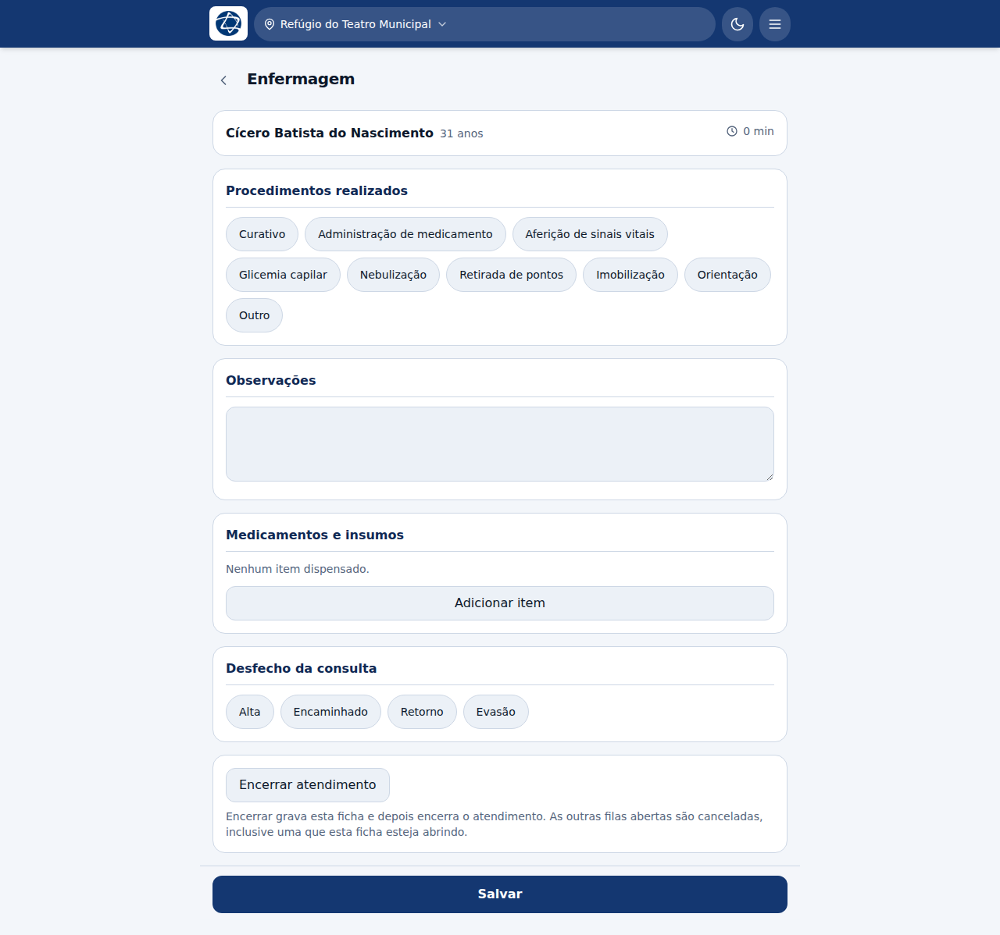
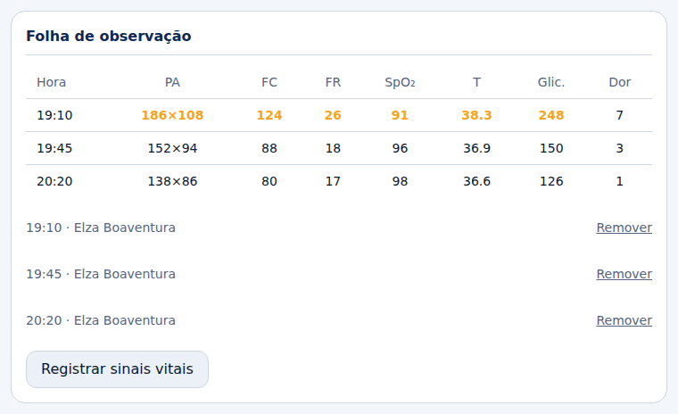
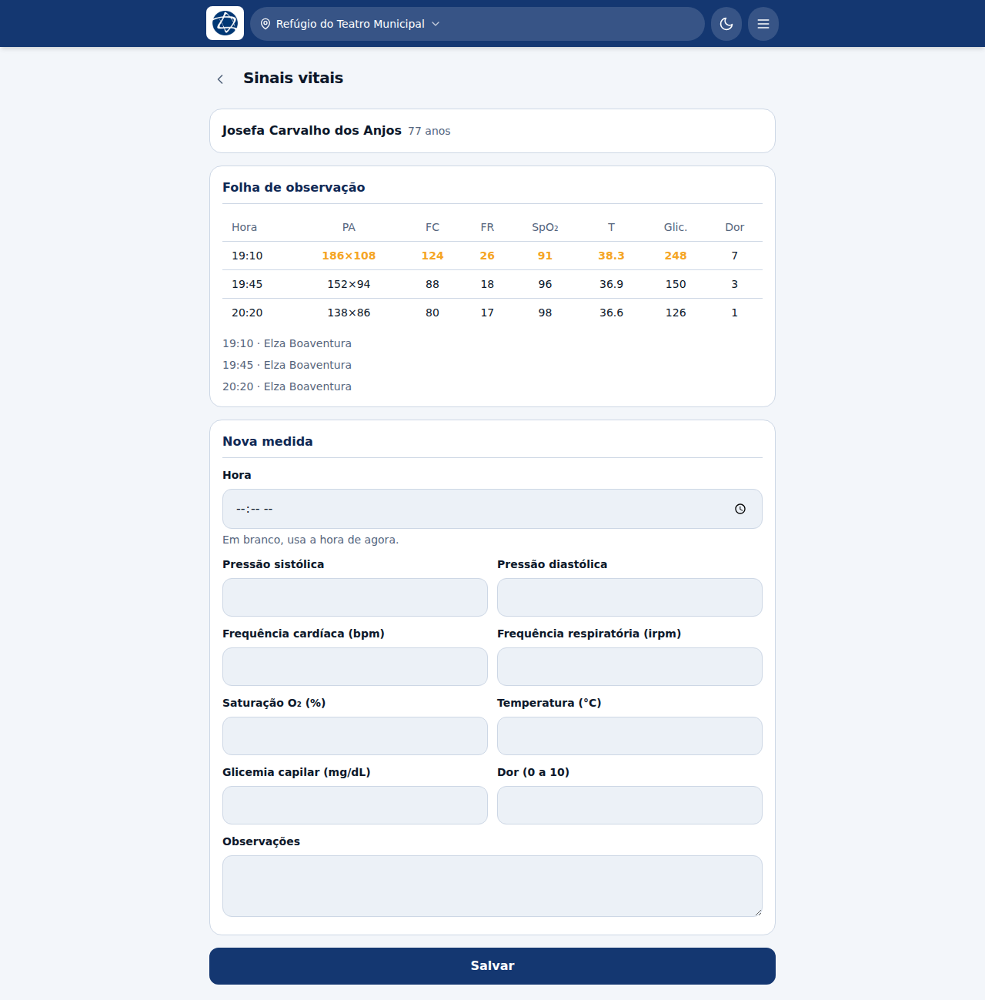

# Enfermagem

**Profissões:** Enfermeiro(a), Técnico(a) de enfermagem
**Filas:** Triagem e Enfermagem

A enfermagem vê **duas filas**, e isso é o desenho, não uma exceção: o plantão
começa triando e depois se atende na fila própria. A aba abre na Triagem; a
segunda aba é a Enfermagem.

Para a triagem, veja [Triagem](04-triagem.md).

## A ficha de enfermagem

É a mais curta do sistema, porque o que se faz aqui é procedimento, não
diagnóstico.

| Bloco | O que registrar |
|---|---|
| **Procedimentos realizados** | Curativo, administração de medicamento, aferição de sinais vitais, glicemia capilar, nebulização, retirada de pontos, imobilização, orientação, outro |
| **Observações** | O que não cabe nos botões |
| **Medicamentos e insumos** | O que foi dispensado, pelo catálogo |
| **Desfecho da consulta** | Alta, Encaminhado, Retorno, Evasão |

Não há CID-10 aqui: o diagnóstico é de quem consultou.

## A folha de observação

É onde entram as medidas repetidas de quem fica em observação. Diferente dos
sinais vitais da triagem, que são uma medida só, esta é uma **tabela**: cada
aferição vira uma linha, com hora.

Chega-se a ela pelo prontuário, em **Folha de observação → Registrar sinais
vitais**.

A **hora** em branco usa a hora de agora — deixe-a em branco quando estiver
registrando na hora, e preencha quando estiver passando para o sistema uma
medida anotada antes.

### O destaque de fora da faixa

Os valores fora da faixa de referência aparecem **em destaque**, como o
`186×108`, `124`, `26`, `91`, `38.3` e `248` da primeira linha do exemplo acima.

Três coisas a saber sobre esse destaque:

- **é do valor, e não da linha inteira.** A pergunta de quem olha a tabela é
  *qual* sinal está alterado;
- **não é escore nem classificação de risco.** Ele marca o que merece um segundo
  olhar, e nada além disso. Quem classifica risco é o protocolo START, na
  triagem;
- **só vale para 12 anos ou mais.** Em criança, frequência cardíaca e
  respiratória são normalmente mais altas, e o corte de adulto marcaria como
  alterada a frequência de um bebê saudável. Uma tabela que acende para todo
  mundo treina a equipe a ignorar o destaque.

As faixas usadas, para adulto:

| Sinal | Destaca quando |
|---|---|
| Pressão sistólica | abaixo de 90 ou acima de 180 |
| Frequência cardíaca | abaixo de 50 ou acima de 120 |
| Frequência respiratória | abaixo de 8 ou acima de 24 |
| Saturação de O₂ | abaixo de 92 |
| Temperatura | abaixo de 35 ou 38 para cima |
| Glicemia capilar | abaixo de 70 ou acima de 200 |

A escala de dor não tem faixa: ela é relato, não medida.

**Remover** apaga uma linha, e isso fica registrado no histórico como ação
própria — no papel a linha errada é riscada, e continua lá.

## Quando cobrir outra fila

Em campo a equipe é curta. Se a fila da triagem estoura e você é enfermeiro, nada
impede que você assuma um paciente da clínica geral — e vice-versa. O sistema
registra no histórico que o atendimento foi feito fora da fila habitual, que é o
que faz a exceção continuar sendo uma exceção rastreável.
