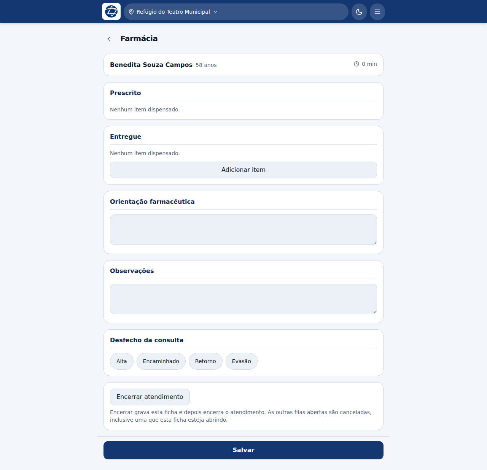

# Farmácia

**Profissão:** Farmacêutico(a) · **Fila:** Farmácia

A farmácia tem **fila própria**. Antes de existir, o farmacêutico caía na fila da
enfermagem — o que misturava a produção das duas e o punha numa fila de
atendimento que não é a dele.

## A ficha

A tela tem dois blocos de itens, e a diferença entre eles é o ponto da etapa:

| Bloco | O que é |
|---|---|
| **Prescrito** | O que os outros profissionais prescreveram para este paciente, somado. É leitura: você não edita aqui |
| **Entregue** | O que a farmácia efetivamente dispensou |

Os dois existirem separados é o que permite responder à pergunta que importa:
**saiu tudo o que foi prescrito?** Se a base estava sem um item, o prescrito
continua registrado e o entregue mostra o que de fato foi.

Além deles:

- **Orientação farmacêutica** — o que o paciente precisa saber sobre o que está
  levando: como tomar, por quantos dias, o que observar;
- **Observações**;
- **Desfecho da consulta** — Alta, Encaminhado, Retorno, Evasão.

## Adicionar um item

**Adicionar item** abre a busca no catálogo da base. Cada item tem categoria
(medicamento, insumo, material, órtese), forma farmacêutica, via de
administração e unidade de dispensação.

Registrar pelo catálogo, e não em texto livre, é o que permite somar o consumo da
missão e repor o que acabou.

## Encerrar

Como em qualquer etapa, o bloco **Encerrar atendimento** no fim da ficha fecha o
atendimento inteiro — útil quando a farmácia é a última parada do paciente, que é
o caso comum. Veja [Alta e desfecho](11-alta-e-desfecho.md).
