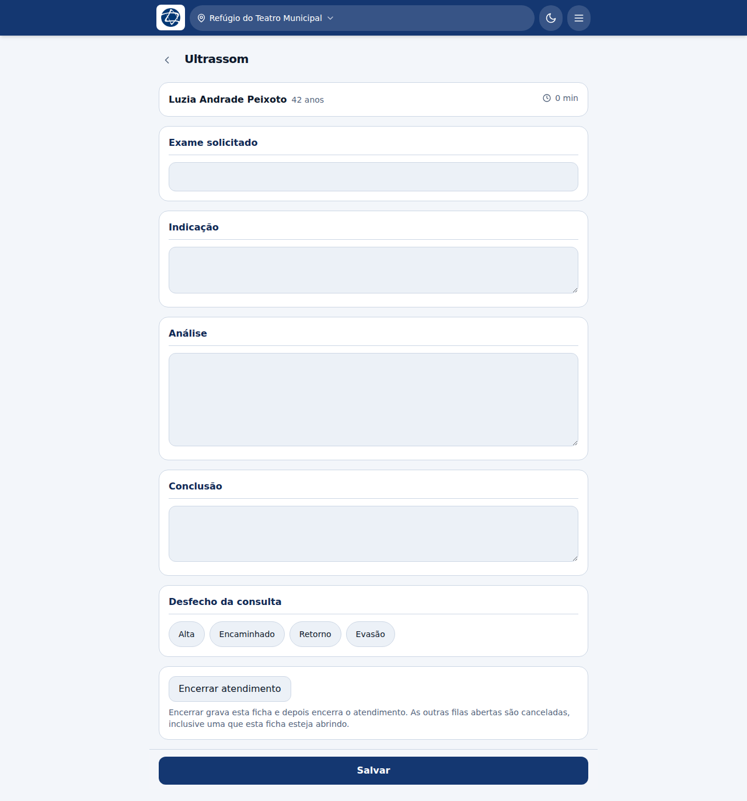

# Ultrassom

**Profissão:** Ultrassonografista · **Fila:** Ultrassom

## Uma fila derivada

Ninguém chega ao ultrassom por conta própria: o paciente sempre vem **encaminhado
por alguém**, e o caminho de volta é a devolução à fila de origem.

Na prática:

1. o clínico (ou outro profissional) encaminha o paciente para Ultrassom,
   dizendo o motivo;
2. você assume, faz o exame e escreve o laudo;
3. **Devolver** o manda de volta para quem pediu — você não precisa lembrar de
   onde ele veio, o sistema sabe.

## A ficha

| Bloco | O que registrar |
|---|---|
| **Exame solicitado** | Qual exame foi pedido |
| **Indicação** | Por que foi pedido — normalmente vem do motivo do encaminhamento |
| **Análise** | O que se viu. É o corpo do laudo |
| **Conclusão** | O fecho do laudo |
| **Desfecho da consulta** | Alta, Encaminhado, Retorno, Evasão |

## O laudo é assinado

O laudo sai com **o seu nome, o conselho e o registro** — no formulário de papel
a linha final é "Médico ___ CRM ___", e um laudo sem ela não vale fora do
sistema.

É por isso que o registro no conselho é obrigatório no cadastro da conta: se ele
estiver errado, o laudo sai errado. Se precisar corrigir, é a coordenação que
ajusta, em **Contas → Alterar profissão**.
