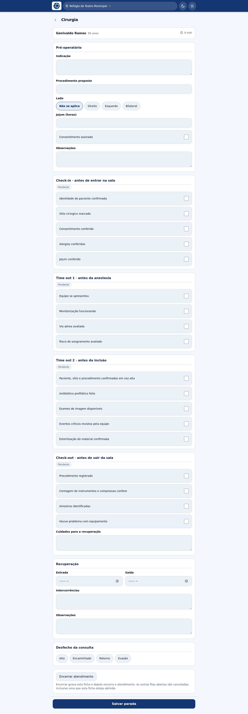

# Cirurgia e anestesia

| Profissão | Filas |
|---|---|
| Cirurgião(ã) | Cirurgia |
| Anestesista | Anestesia, Cirurgia |

O anestesista vê **duas filas** porque avalia antes da cirurgia e acompanha
durante: as duas são o trabalho dele, não uma exceção. A fila de Anestesia usa a
ficha de consulta comum ([Consultas](05-consultas.md)); a de Cirurgia usa a ficha
descrita abaixo.

## A ficha cirúrgica

É a ficha mais longa do sistema, e é assim de propósito: ela é a **lista de
verificação de cirurgia segura** da OMS/ANVISA, e o valor dela está em ser
percorrida inteira, na ordem, em voz alta.

### Pré-operatório

| Campo | Observação |
|---|---|
| **Indicação** | Por que operar |
| **Procedimento proposto** | O que será feito |
| **Lado** | Não se aplica / Direito / Esquerdo / Bilateral. **Campo próprio**, e não parte do texto do procedimento: cirurgia no lado errado é um dos erros que a lista existe para impedir, e em texto livre "joelho D", "joelho dto" e "joelho direito" não conferem contra nada |
| **Jejum (horas)** | |
| **Consentimento assinado** | |
| **Observações** | |

### As quatro paradas

Cada bloco tem o próprio selo de situação (**Pendente** até ser completado).

**1. Check-in — antes de entrar na sala**

- Identidade do paciente confirmada
- Sítio cirúrgico marcado
- Consentimento conferido
- Alergias conferidas
- Jejum conferido

**2. Time out 1 — antes da anestesia**

- Equipe se apresentou
- Monitorização funcionando
- Via aérea avaliada
- Risco de sangramento avaliado

**3. Time out 2 — antes da incisão**

- Paciente, sítio e procedimento confirmados em voz alta
- Antibiótico profilático feito
- Exames de imagem disponíveis
- Eventos críticos revistos pela equipe
- Esterilização do material confirmada

**4. Check-out — antes de sair da sala**

- Procedimento registrado
- Contagem de instrumentos e compressas confere
- Amostras identificadas
- Houve problema com equipamento
- **Cuidados para a recuperação** (texto)

### Recuperação

Hora de **entrada** e **saída**, **intercorrências** e **observações**.

## Salvar parada por parada

O botão do rodapé diz **Salvar parada**: a ficha é gravada em pontos, conforme a
cirurgia avança. Não é preciso — nem desejável — esperar o fim para registrar.

## Encerrar

Ao fim, o bloco **Encerrar atendimento** fecha o atendimento com o desfecho. Veja
[Alta e desfecho](11-alta-e-desfecho.md).
