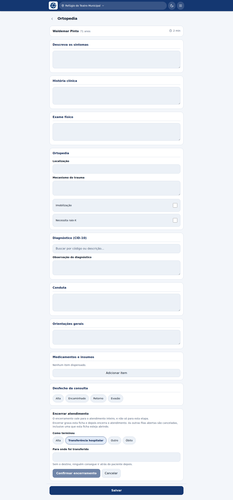
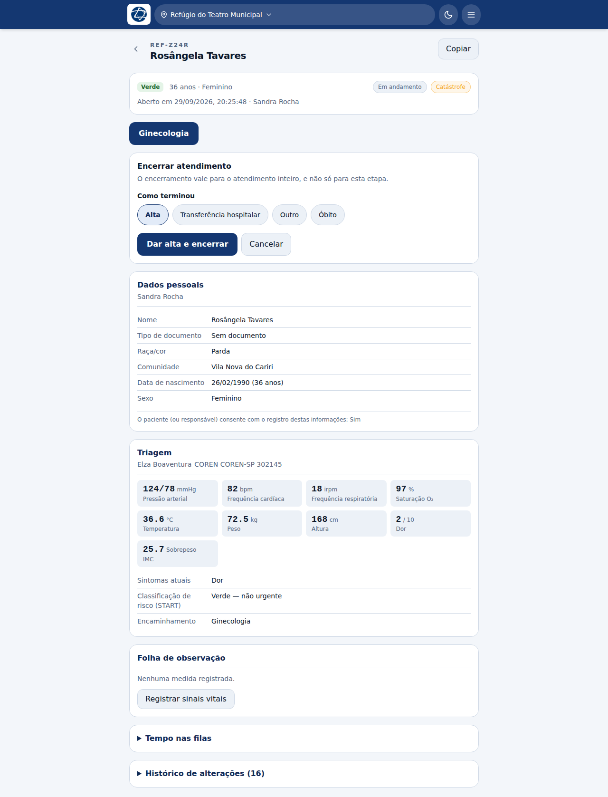
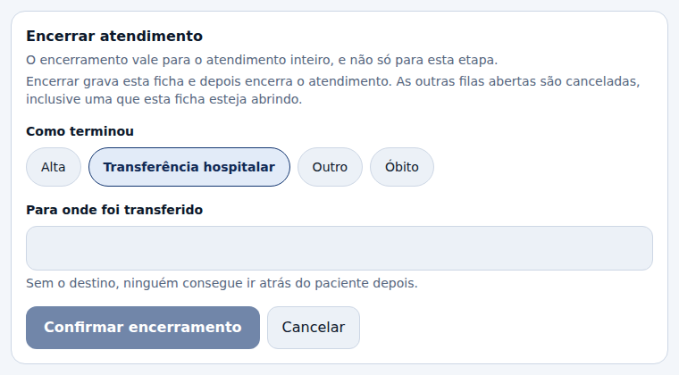

# Alta e desfecho

Vale para todas as profissões.

## A regra

**Dá para encerrar o atendimento de qualquer etapa.** Quem está com o paciente na
mão encerra dali mesmo: não é preciso gravar a ficha, voltar uma tela e procurar
outro botão.

O bloco **Encerrar atendimento** aparece:

- **no fim de cada ficha** — triagem, consultas, odontologia, enfermagem,
  ultrassom, farmácia, cirurgia;
- **no prontuário**, mesmo quando não há nenhuma fila aberta.

## Duas coisas diferentes com nomes parecidos

| | O que é |
|---|---|
| **Desfecho da consulta** (dentro da ficha: Alta, Encaminhado, Retorno, Evasão) | Como *esta consulta* terminou. Não fecha o atendimento |
| **Encerrar atendimento** (o bloco no fim) | Fecha o **atendimento inteiro**, com o desfecho registrado |

## Encerrar a partir de uma ficha

Ao confirmar, o sistema faz duas coisas, nesta ordem:

1. **grava a ficha** que está aberta — o que você escreveu nela é o registro do
   que justificou a alta;
2. **encerra o atendimento** com o desfecho escolhido.

Se a ficha for recusada (falta um campo obrigatório, por exemplo), **a alta não
acontece**: o erro aparece e o atendimento continua aberto. Você não perde o que
escreveu.

## Encerrar a partir do prontuário

Mesmo formulário. Serve para quem já saiu da ficha, e também para o atendimento
que não tem nenhuma fila aberta — o paciente triado e liberado, por exemplo, que
antes não tinha caminho nenhum para uma alta registrada.

Nesse caso o encerramento fica registrado pela **última etapa concluída**, que é
de onde o paciente está saindo.

## Os quatro desfechos

| Desfecho | Exige |
|---|---|
| **Alta** | Nada além da confirmação |
| **Transferência hospitalar** | **Para onde foi transferido.** Sem o destino, ninguém consegue ir atrás do paciente depois |
| **Óbito** | Confirmação. Fica registrado como ação própria no histórico |
| **Outro** | Uma descrição do que aconteceu |

O botão **Confirmar encerramento** fica apagado enquanto o campo obrigatório do
desfecho escolhido não estiver preenchido.

## E as outras filas em que o paciente estava?

**São canceladas**, inclusive a da ficha que você está usando. A tela avisa isso
antes de você confirmar.

O cancelamento de cada fila pendente fica registrado no histórico como ação
própria, com o seu nome: tirar o paciente da fila da odontologia é uma decisão
clínica de alguém, e daqui a um mês a pergunta vai ser quem tirou.

## Depois de encerrado

O atendimento passa a **Finalizado** e para de aceitar edição. O prontuário
continua legível por todo mundo.

Se foi engano, **Reabrir** existe — e pede uma justificativa, que fica no
histórico. Toda edição feita depois de uma finalização é marcada como tal.

## O que *não* dá para fazer com a etapa concluída

**Encaminhar** e **Devolver** só existem enquanto a etapa está aberta. A API
recusa os dois com a etapa concluída, e um botão que só serve para receber erro é
pior que botão nenhum — por isso eles somem da tela.
