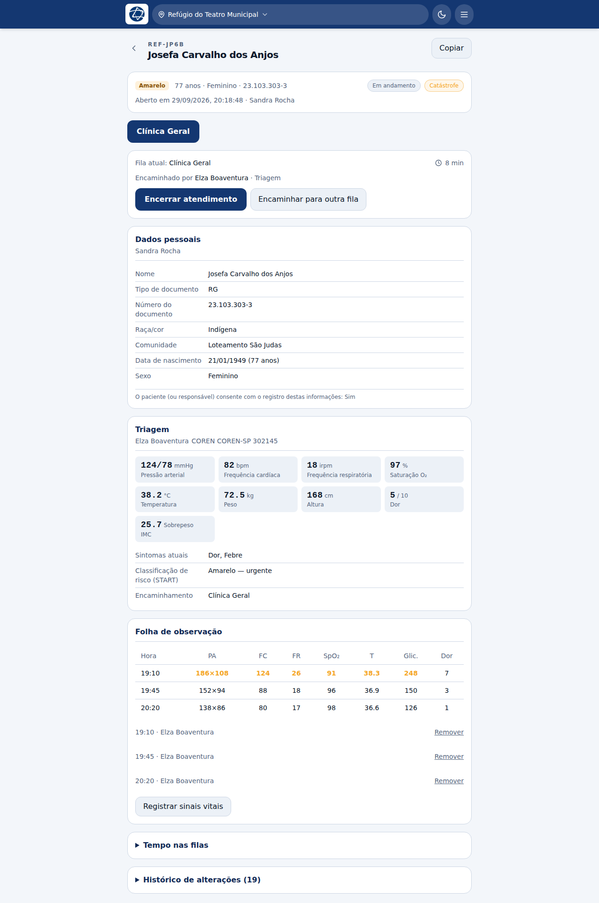
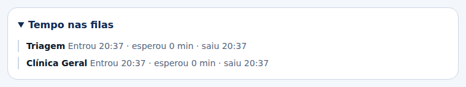
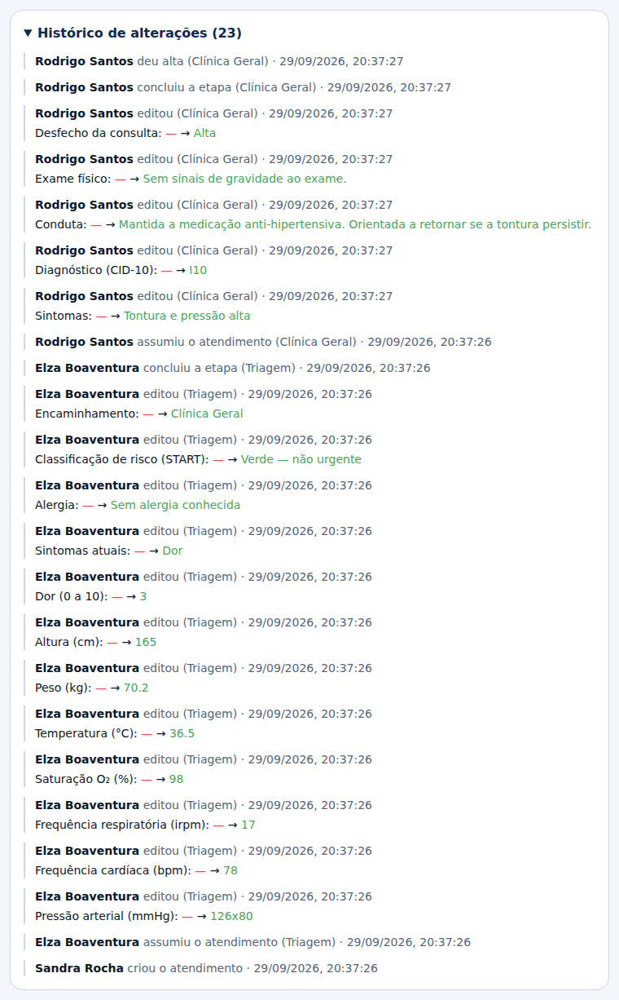
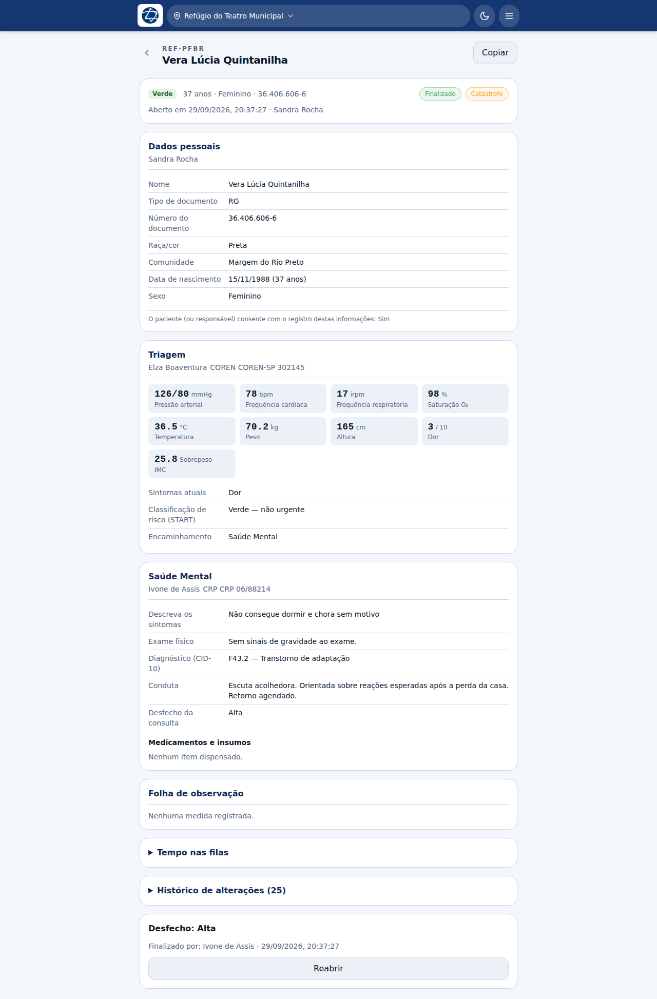

# Prontuário e auditoria

O prontuário é a tela que reúne tudo sobre um atendimento. Chega-se a ele tocando
no cartão do paciente na fila.

## A ordem da tela

A tela é organizada pelo que se **faz** antes do que se **lê**:

1. **identidade** — risco, idade, sexo, documento, alergia, desde quando está
   aqui, e o tipo da missão;
2. **fila atual e ações** — Encerrar atendimento, Encaminhar para outra fila, e
   quem encaminhou o paciente até aqui;
3. **dados pessoais**;
4. **fichas já preenchidas** — triagem, consultas, odontologia, o que houver;
5. **folha de observação**;
6. **tempo nas filas** e **histórico de alterações**, recolhidos.

O código do atendimento fica acima do nome, com botão **Copiar** — é o que se
passa por rádio ou se anota no papel.

## Sinais vitais da triagem

Os números aparecem em blocos: o valor grande, a unidade junto e o rótulo
embaixo. O olho vai ao número, e o rótulo confirma.

O **IMC** é calculado de peso e altura e mostrado com a faixa da OMS — mas só a
partir dos 20 anos. Em criança o IMC se lê em curva por idade, e o corte de
adulto diria "baixo peso" para uma criança saudável.

Diferente da [folha de observação](07-enfermagem.md#a-folha-de-observação), esta
grade **não marca valores fora da faixa**. É deliberado: o servidor só calcula
faixa de referência para a folha de observação, e aplicar o corte de adulto aqui
acusaria quase toda criança.

## Tempo nas filas

Por onde o paciente passou, quanto esperou em cada fila e quando saiu. É o que
responde "onde este atendimento travou".

## Histórico de alterações

É a auditoria do atendimento, do mais recente para o mais antigo. Cada linha traz
**quem**, **o que fez**, **em que etapa** e **quando** — e, nas edições, o valor
anterior e o novo.

As ações registradas incluem:

| Ação | Quando acontece |
|---|---|
| Criou o atendimento | No cadastro |
| Assumiu / liberou a etapa | Ao pegar ou devolver o paciente |
| Assumiu fora da sua fila | Quando alguém cobre outra função |
| Editou | Cada campo alterado, com o valor de antes e o de depois |
| Concluiu a etapa | |
| Encaminhou para outra fila / devolveu para a origem | |
| Cancelou fila pendente | Ao dar alta com outras filas abertas |
| Deu alta / registrou óbito / transferiu para hospital / encerrou por outro motivo | Cada desfecho é uma ação própria |
| Registrou / removeu sinais vitais | Na folha de observação |
| Reabriu o atendimento | Com a justificativa |
| Editou após finalização | Marcado como tal |

### Por que o histórico é legível

O que o sistema **grava** é canônico: `triagem.classificacaoRisco` e `Vermelho`,
nunca "Classificação de risco (START)" e "Vermelho — emergência". A tradução
acontece na hora de exibir, no idioma de quem está lendo.

São duas razões:

- um registro feito por alguém operando em espanhol apareceria em espanhol para
  quem revisa em português meses depois;
- gravar o nome interno e mostrá-lo cru é exatamente o defeito que motivou este
  projeto — o `consulta_medica` cru no relatório de encaminhamentos do sistema
  anterior.

## Depois de finalizado

No fim da tela aparece o **desfecho**, com quem finalizou e quando. O atendimento
para de aceitar edição.

**Reabrir** existe e pede justificativa. A justificativa e tudo o que for editado
depois ficam marcados no histórico.

## Quem pode ver

Qualquer pessoa da equipe com acesso ao sistema pode abrir qualquer prontuário da
base. Não há tranca por profissão — em campo a equipe é curta e trancar pararia o
plantão sem proteger nada, já que quem entrou no sistema foi cadastrado pela
coordenação.

O que existe no lugar da tranca é **rastro**: tudo o que se faz fica no histórico
com nome e hora.
